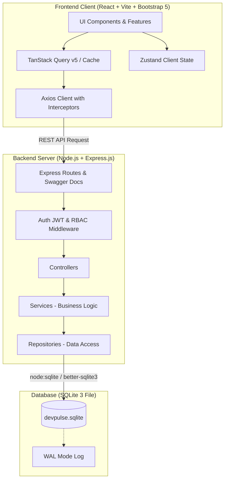

# 🚀 DevPulse CRM — Technical Specification & Architecture Plan

> **Technical Operations, SLA Monitoring & API Integration Management Platform**  
> **Tech Stack:** React.js (JavaScript) + Node.js (Express.js) + SQLite (`.sqlite`) + Bootstrap 5

---

## 📑 Daftar Isi (Table of Contents)
- [1. Ringkasan Eksekutif & Karakteristik Technical CRM](#1-ringkasan-eksekutif--karakteristik-technical-crm)
- [2. Arsitektur Sistem & Tech Stack](#2-arsitektur-sistem--tech-stack)
  - [2.1 Frontend Client Stack](#21-frontend-client-stack)
  - [2.2 Backend Server Stack](#22-backend-server-stack)
  - [2.3 Standar Dokumentasi & Persiapan Refactoring](#23-standar-dokumentasi--persiapan-refactoring)
- [3. Tipe Pengguna Teknis & Operasional Sistem](#3-tipe-pengguna-teknis--operasional-sistem)
- [4. Diagram Arsitektur & Alur Data](#4-diagram-arsitektur--alur-data)
- [5. Desain Skema Database SQLite (.sqlite) & Dynamic JSON](#5-desain-skema-database-sqlite-sqlite--dynamic-json)
- [6. Komponen Reusable & Prinsip Clean Code (Bootstrap 5)](#6-komponen-reusable--prinsip-clean-code-bootstrap-5)
  - [6.1 Komponen Reusable Inti](#61-komponen-reusable-inti)
  - [6.2 Standar Clean Code & Pola JSDoc](#62-standar-clean-code--pola-jsdoc)
- [7. Standar Integrasi RESTful API & Keamanan](#7-standar-integrasi-restful-api--keamanan)
  - [7.1 Format Response Envelope](#71-format-response-envelope)
  - [7.2 Axios Interceptors & Silent Refresh](#72-axios-interceptors--silent-refresh)
- [8. Strategi Optimasi Performa](#8-strategi-optimasi-performa)
- [9. Struktur Direktori Proyek (Feature-Driven JavaScript)](#9-struktur-direktori-proyek-feature-driven-javascript)
- [10. Roadmap Implementasi Bertahap (Sprint 1 - 5)](#10-roadmap-implementasi-bertahap-sprint-1---5)

---

## 1. Ringkasan Eksekutif & Karakteristik Technical CRM

**DevPulse CRM** adalah platform *Customer Relationship Management* (CRM) operasional teknis yang dirancang khusus untuk ekosistem B2B IT, platform API, dan penyedia layanan digital. Berbeda dengan CRM penjualan tradisional yang berfokus pada prospek komersial, DevPulse menangani siklus hidup integrasi teknis developer dan kepatuhan SLA klien korporat.

### Tujuan Utama & Standar Pengembangan
- **Clean Code & Reusability pada JavaScript:** Membangun komponen UI yang modular, terdekonsentrasi, dan dapat digunakan kembali menggunakan React.js dan Bootstrap 5 tanpa TypeScript, dengan mengandalkan dokumentasi JSDoc yang kuat untuk autocompletion dan type-checking.
- **Penyimpanan Berkas SQLite (`.sqlite`) yang Dioptimalkan:** Memanfaatkan database berkas lokal SQLite dengan driver performa tinggi (baik `node:sqlite` bawaan Node 22/24 maupun `better-sqlite3`), mengaktifkan mode WAL (*Write-Ahead Logging*), serta memanfaatkan fungsi JSON bawaan (`json_extract`, `json_set`) untuk skema dinamis.
- **Integrasi RESTful API Standar Industri:** Membangun arsitektur backend Express.js berlapis (*Controller-Service-Repository*) dengan JWT token refresh otomatis via cookie *HTTP-Only*.
- **Performa Skala Data:** Menerapkan list virtualization, debounced filtering, dan caching server-state dengan TanStack Query v5.
- **Dokumentasi Terstruktur untuk Refactor:** Menyediakan dokumentasi visual Storybook, spesifikasi OpenAPI/Swagger, serta struktur direktori berbasis fitur (*Feature-Driven Architecture*).

---

## 2. Arsitektur Sistem & Tech Stack (JavaScript + SQLite Ecosystem)

### 2.1 Frontend Client Stack

| Komponen | Teknologi Terpilih | Alasan & Peran Teknis |
| :--- | :--- | :--- |
| **Framework & Bundler** | React.js (v18+) + Vite | Pengembangan cepat, hot module replacement instan, dan ekosistem modular JavaScript murni (ES6+ / JSX). |
| **UI Framework & Styling** | Bootstrap 5 + React-Bootstrap + Sass/SCSS | Sistem grid responsif industri, utilitas styling modern, dan isolasi kustomisasi melalui variabel SCSS. |
| **Server State & Caching** | TanStack Query (React Query) v5 | Menangani fetching data, background synchronization, cache invalidation, dan optimistic updates. |
| **Client UI State** | Zustand | State manager yang sangat ringan untuk mengontrol modal, drawer, sidebar collapse, dan preferensi antarmuka tanpa boilerplates. |
| **Form & Schema Validation**| React Hook Form + Zod | Manajemen form performan tanpa re-render berlebih, divalidasi dengan skema Zod JavaScript saat runtime. |
| **Virtual Rendering** | `@tanstack/react-virtual` | Render virtualisasi untuk merender ribuan baris log insiden atau daftar klien secara mulus di 60 FPS. |

### 2.2 Backend Server Stack

| Komponen | Teknologi Terpilih | Alasan & Peran Teknis |
| :--- | :--- | :--- |
| **Runtime & Modul** | Node.js (v20+ LTS / v24) dengan ES Modules | Mendukung sintaks JavaScript modern murni (`import`/`export`) tanpa kebutuhan kompilasi TypeScript. |
| **Web Framework** | Express.js | Framework minimalis, fleksibel, dan terbukti stabil untuk perancangan RESTful API terstruktur. |
| **Database Engine** | SQLite 3 (Berkas `.sqlite`) | Ringan, portable, tanpa ketergantungan server database eksternal, ideal untuk evaluasi dan simulasi operasional. |
| **Database Driver** | `node:sqlite` (Node 22/24 Native) / `better-sqlite3` | Driver synchronous berkecepatan tinggi dengan latensi sub-milidetik dan dukungan transaksi atomik yang kuat. |
| **Autentikasi** | JSON Web Token (JWT) | Access Token berumur pendek (15 menit) di memori aplikasi, Refresh Token (7 hari) tersimpan aman di HTTP-Only Cookie. |

### 2.3 Standar Dokumentasi & Persiapan Refactoring
- **JSDoc Type-Checking:** Setiap berkas JavaScript dilengkapi anotasi JSDoc (`@typedef`, `@param`, `@returns`) serta direktif `// @ts-check` di baris pertama agar Visual Studio Code memberikan peringatan galat tipe secara langsung.
- **Katalog Komponen Storybook:** Komponen UI umum didokumentasikan di Storybook dengan ragam varian status (*Healthy*, *Warning*, *Critical*) untuk isolasi uji coba UI.
- **Swagger / OpenAPI 3.0:** Endpoint API backend didokumentasikan menggunakan komentar JSDoc Swagger via `swagger-jsdoc` dan disajikan interaktif di `/api/docs`.

---

## 3. Tipe Pengguna Teknis & Operasional Sistem

1. **Solutions Architect / Integration Engineer:**  
   Mengelola kartu integrasi di Kanban board (*Proof of Concept* $\rightarrow$ *Architecture Review* $\rightarrow$ *UAT* $\rightarrow$ *Production Go-Live*), memvalidasi URL webhook, dan melakukan tes koneksi integrasi.
2. **Technical Account Manager (TAM) / DevRel:**  
   Memantau distribusi versi API klien, menyaring akun yang menggunakan versi deprecated di Dynamic Data Grid, serta mencatat laporan evaluasi berkala di Technical Timeline.
3. **DevOps / SRE / Support Tier-3:**  
   Mengatur batasan Rate Limiting (RPS) dan kuota request via inline-editing, memantau log error webhook yang gagal, serta menginvestigasi perubahan konfigurasi via Audit Trail.
4. **Platform & Security Administrator:**  
   Menambah atribut metadata teknis baru secara dinamis ke dalam kolom JSON SQLite tanpa perlu migrasi DDL, serta mengelola hak akses role pengguna.

---

## 4. Diagram Arsitektur & Alur Data



---

## 5. Desain Skema Database SQLite (`.sqlite`) & Dynamic JSON

> [!NOTE]
> Database disimpan dalam berkas lokal `backend/data/devpulse.sqlite`.  
> Menggunakan mode **WAL (Write-Ahead Logging)** untuk memastikan pembacaan data tidak memblokir proses penulisan.

```sql
-- Konfigurasi Performa SQLite
PRAGMA foreign_keys = ON;
PRAGMA journal_mode = WAL;
PRAGMA synchronous = NORMAL;

-- 1. Tabel Klien Teknis (Clients)
CREATE TABLE IF NOT EXISTS clients (
    id TEXT PRIMARY KEY,                       -- UUID v4 string
    company_name TEXT NOT NULL,
    technical_tier TEXT NOT NULL,              -- 'Standard', 'Enterprise SLA', 'Mission-Critical'
    integration_stage TEXT NOT NULL,           -- 'sandbox', 'review', 'uat', 'production', 'maintenance'
    assigned_engineer_id TEXT,
    rate_limit_rps INTEGER DEFAULT 100,
    created_at TEXT DEFAULT (datetime('now')),
    updated_at TEXT DEFAULT (datetime('now')),
    technical_metadata TEXT                    -- JSON format (SQLite JSON1)
);

-- Index Relasional & Index JSON
CREATE INDEX IF NOT EXISTS idx_clients_stage ON clients(integration_stage);
CREATE INDEX IF NOT EXISTS idx_clients_tier ON clients(technical_tier);
CREATE INDEX IF NOT EXISTS idx_clients_api_ver ON clients(json_extract(technical_metadata, '$.api_version'));

-- 2. Tabel Timeline Aktivitas & Insiden (Technical Activities)
CREATE TABLE IF NOT EXISTS technical_activities (
    id TEXT PRIMARY KEY,
    client_id TEXT NOT NULL,
    activity_type TEXT NOT NULL,               -- 'INCIDENT', 'MEETING', 'CONFIG_CHANGE', 'KEY_ROTATION'
    title TEXT NOT NULL,
    content TEXT,
    severity TEXT DEFAULT 'LOW',               -- 'LOW', 'MEDIUM', 'HIGH', 'CRITICAL'
    performed_by TEXT NOT NULL,
    created_at TEXT DEFAULT (datetime('now')),
    FOREIGN KEY (client_id) REFERENCES clients(id) ON DELETE CASCADE
);

-- 3. Tabel Audit Trail Sistem
CREATE TABLE IF NOT EXISTS audit_trails (
    id TEXT PRIMARY KEY,
    entity_type TEXT NOT NULL,                 -- 'CLIENT', 'API_KEY', 'WEBHOOK'
    entity_id TEXT NOT NULL,
    action TEXT NOT NULL,                      -- 'CREATE', 'UPDATE', 'DELETE', 'ROTATE'
    changed_by TEXT NOT NULL,
    old_data TEXT,                             -- Snapshot data JSON sebelum perubahan
    new_data TEXT,                             -- Snapshot data JSON sesudah perubahan
    created_at TEXT DEFAULT (datetime('now'))
);
```

---

## 6. Komponen Reusable & Prinsip Clean Code (Bootstrap 5)

### 6.1 Komponen Reusable Inti

- `<DataTable columns={...} data={...} onSort={...} />`: Komponen tabel generik berbasis JavaScript murni dengan kontrol sorting, filter kolom, dan status pagination.
- `<KanbanBoard stages={...} onCardDrop={...} />`: Papan alur integrasi interaktif dengan drag-and-drop dan optimistic update instan.
- `<StatusBadge status={...} variantMap={...} />`: Komponen badge Bootstrap dengan varian warna kustom dan animasi pulsing dot untuk status endpoint webhook (*Healthy*, *Degraded*, *Failing*).
- `<JsonMetadataViewer data={...} onSave={...} />`: Komponen inspektor & editor key-value untuk memanipulasi kolom JSON SQLite secara interaktif tanpa menulis JSON mentah.
- `<TechnicalTimeline items={...} />`: Feed kronologis insiden dan riwayat komunikasi dengan penanda warna level keparahan (*severity*).
- `<ModalForm schema={...} onSubmit={...} />`: Modal form dinamis yang diintegrasikan langsung dengan skema Zod dan React Hook Form.

### 6.2 Standar Clean Code & Pola JSDoc

```javascript
// @ts-check

/**
 * @typedef {Object} ClientItem
 * @property {string} id - UUID klien
 * @property {string} company_name - Nama korporasi klien
 * @property {'Standard'|'Enterprise SLA'|'Mission-Critical'} technical_tier
 * @property {'sandbox'|'review'|'uat'|'production'} integration_stage
 * @property {number} rate_limit_rps
 * @property {Object} technical_metadata
 */

/**
 * Komponen Reusable Status Badge untuk webhook & health status
 * @param {Object} props
 * @param {'healthy'|'degraded'|'failing'} props.status - Status kesehatan teknis
 * @param {string} [props.label] - Label opsional tambahan
 * @returns {JSX.Element}
 */
export function WebhookStatusBadge({ status, label }) {
  const badgeClass = 
    status === 'healthy' 
      ? 'bg-success' 
      : status === 'degraded' 
        ? 'bg-warning text-dark' 
        : 'bg-danger';

  return (
    <span className={`badge ${badgeClass} d-inline-flex align-items-center gap-1`}>
      <span 
        className="spinner-grow spinner-grow-sm" 
        style={{ width: '0.4rem', height: '0.4rem' }} 
      />
      {label || status.toUpperCase()}
    </span>
  );
}
```

---

## 7. Standar Integrasi RESTful API & Keamanan

### 7.1 Format Response Envelope

```json
{
  "success": true,
  "data": [
    {
      "id": "c1f7a240-6258-48b5-b778-9e6347fcf648",
      "company_name": "Enterprise Client Inc",
      "technical_tier": "Enterprise SLA",
      "integration_stage": "uat",
      "rate_limit_rps": 1500,
      "technical_metadata": {
        "api_version": "v2.4",
        "runtime_stack": "Node.js 20",
        "webhook_url": "/api/v1/mock-events"
      }
    }
  ],
  "meta": {
    "page": 1,
    "limit": 25,
    "totalItems": 85,
    "totalPages": 4
  },
  "message": "Data klien teknis berhasil dimuat"
}
```

### 7.2 Axios Interceptors & Silent Refresh
Instance HTTP Client dikonfigurasi di `src/services/apiClient.js`:
- **Request Interceptor:** Menyisipkan header `Authorization: Bearer <access_token>` yang disimpan dalam state memori.
- **Response Interceptor:** Mendeteksi respons HTTP `401`. Secara otomatis memanggil endpoint `/api/auth/refresh` menggunakan kredensial cookie *HTTP-Only*, memperbarui access token di memori, dan mengulangi request awal yang tertunda tanpa gangguan bagi pengguna.

---

## 8. Strategi Optimasi Performa

- **SQLite Driver Optimization:** Menggunakan `node:sqlite` / `better-sqlite3` dengan mode synchronous dan WAL mode menghasilkan waktu eksekusi query lokal di bawah 1 milidetik.
- **Index pada SQLite JSON:** Menggunakan indeks fungsional `json_extract(technical_metadata, '$.api_version')` sehingga filter versi API klien tetap instan pada ribuan baris data.
- **DOM Virtualization (`@tanstack/react-virtual`):** Merender hanya 20–30 node DOM yang terlihat pada Data Grid dan Log Audit, menghemat penggunaan RAM browser secara signifikan.
- **Debounced Server Requests:** Input pencarian nama perusahaan atau token di-debounce 300ms untuk mencegah eksekusi query berlebihan ke database SQLite.
- **Code-Splitting:** Memuat modul Kanban dan Incident Management menggunakan `React.lazy()` dan `React.Suspense` agar ukuran bundel awal aplikasi tetap di bawah 200 KB gzipped.

---

## 9. Struktur Direktori Proyek (Feature-Driven JavaScript)

```text
devpulse-crm/
├── backend/
│   ├── data/
│   │   └── devpulse.sqlite          # Berkas database SQLite
│   ├── src/
│   │   ├── config/                  # Koneksi SQLite & konfigurasi env
│   │   ├── controllers/             # Express request/response handlers
│   │   ├── middlewares/             # Auth JWT, RBAC, error handler
│   │   ├── repositories/            # Database queries (SQLite DML/DQL)
│   │   ├── services/                # Logika bisnis & integrasi
│   │   ├── routes/                  # Express routing endpoints
│   │   └── server.js                # Server entry point
│   ├── package.json
│   └── swagger.json
│
└── frontend/
    ├── src/
    │   ├── assets/                  # Kustomisasi SCSS & ikon
    │   ├── components/              # Komponen reusable umum (DataTable, ModalForm, StatusBadge)
    │   ├── features/                # Modul berbasis domain fitur
    │   │   ├── auth/                # Login, session management
    │   │   ├── clients/             # Data Grid, JSON metadata editor
    │   │   ├── integrations/        # Kanban board tahapan integrasi
    │   │   ├── monitoring/          # Webhook health check & SLA cards
    │   │   └── activities/          # Technical Timeline & Incident logging
    │   ├── hooks/                   # Custom hooks global (useDebounce, useApiClient)
    │   ├── services/                # Axios instance & API wrapper
    │   ├── utils/                   # Formatters & helper functions
    │   ├── App.jsx
    │   └── main.jsx
    ├── .storybook/                  # Konfigurasi Storybook
    └── package.json
```

---

## 10. Roadmap Implementasi Bertahap (Sprint 1 - 5)

- [x] **Sprint 1 — Fondasi & Setup Lingkungan**
  - Inisialisasi backend Express dengan driver `node:sqlite` (DatabaseSync) native Node 24.
  - Migrasi skema tabel DDL & konfigurasi mode WAL.
  - Setup React Vite dengan tema kustom Bootstrap 5 SCSS.

- [x] **Sprint 2 — Data Grid & Dynamic JSON Metadata**
  - Pembuatan komponen generik `<DataTable />`.
  - Integrasi endpoint CRUD klien teknis.
  - Fitur query filter berbasis `json_extract`.

- [x] **Sprint 3 — Pipeline Kanban Integrasi Teknis**
  - Pembangunan Kanban board untuk memantau status onboarding klien (*Sandbox* $\rightarrow$ *Production*).
  - Drag-and-drop dan optimistic update via TanStack Query.

- [x] **Sprint 4 — Monitoring Webhook & Timeline Insiden**
  - Pembuatan kartu metrik SLA & fitur simulasi ping endpoint webhook.
  - Feed kronologis insiden teknis & audit trail.

- [x] **Sprint 5 — Optimasi, Storybook & Refactoring Check**
  - Penerapan DOM virtualization (`@tanstack/react-virtual`).
  - Pembuatan katalog komponen Storybook / Component Showcase.
  - Dokumentasi Swagger UI API & audit performa.

---

> *Dokumen Spesifikasi Disahkan untuk Pengembangan Proyek DevPulse CRM.*
